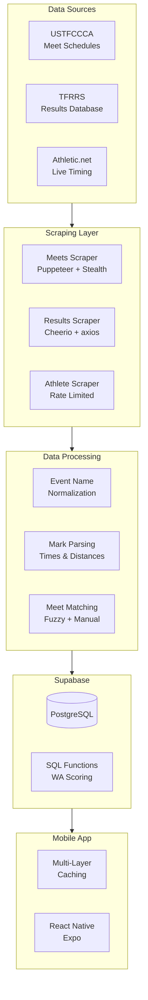

# TrackHub Architecture Diagram

## System Architecture (ASCII)

```
┌─────────────────────────────────────────────────────────────────────────────┐
│                              DATA SOURCES                                    │
├─────────────────────────────────────────────────────────────────────────────┤
│                                                                              │
│    ┌──────────────┐     ┌──────────────┐     ┌──────────────┐              │
│    │   USTFCCCA   │     │    TFRRS     │     │ Athletic.net │              │
│    │              │     │              │     │              │              │
│    │  Meet        │     │  Results     │     │  Live        │              │
│    │  Schedules   │     │  Database    │     │  Timing      │              │
│    └──────┬───────┘     └──────┬───────┘     └──────┬───────┘              │
│           │                    │                    │                       │
└───────────┼────────────────────┼────────────────────┼───────────────────────┘
            │                    │                    │
            ▼                    ▼                    ▼
┌─────────────────────────────────────────────────────────────────────────────┐
│                           SCRAPING LAYER                                     │
├─────────────────────────────────────────────────────────────────────────────┤
│                                                                              │
│  ┌─────────────────────────────────────────────────────────────────────┐    │
│  │                        Node.js Scrapers                              │    │
│  │                                                                      │    │
│  │  ┌─────────────────┐  ┌─────────────────┐  ┌─────────────────┐     │    │
│  │  │ Meets Scraper   │  │ Results Scraper │  │ Athlete Scraper │     │    │
│  │  │                 │  │                 │  │                 │     │    │
│  │  │ • Puppeteer     │  │ • Cheerio       │  │ • Rate Limited  │     │    │
│  │  │ • Stealth       │  │ • axios         │  │ • Checkpoint    │     │    │
│  │  │ • Cloudflare    │  │ • Fuzzy Match   │  │ • Resume        │     │    │
│  │  │   Bypass        │  │                 │  │                 │     │    │
│  │  └────────┬────────┘  └────────┬────────┘  └────────┬────────┘     │    │
│  │           │                    │                    │              │    │
│  └───────────┼────────────────────┼────────────────────┼──────────────┘    │
│              │                    │                    │                    │
└──────────────┼────────────────────┼────────────────────┼────────────────────┘
               │                    │                    │
               ▼                    ▼                    ▼
┌─────────────────────────────────────────────────────────────────────────────┐
│                          DATA PROCESSING                                     │
├─────────────────────────────────────────────────────────────────────────────┤
│                                                                              │
│  ┌─────────────────┐  ┌─────────────────┐  ┌─────────────────┐             │
│  │ Event Name      │  │ Mark Parsing    │  │ Meet Matching   │             │
│  │ Normalization   │  │                 │  │                 │             │
│  │                 │  │ • Time formats  │  │ • Fuzzy match   │             │
│  │ • 100+ mappings │  │ • Distance      │  │ • Manual maps   │             │
│  │ • Regex rules   │  │ • Validation    │  │ • Date range    │             │
│  └────────┬────────┘  └────────┬────────┘  └────────┬────────┘             │
│           │                    │                    │                       │
└───────────┴────────────────────┴────────────────────┴───────────────────────┘
                                 │
                                 ▼
┌─────────────────────────────────────────────────────────────────────────────┐
│                           DATABASE LAYER                                     │
├─────────────────────────────────────────────────────────────────────────────┤
│                                                                              │
│  ┌─────────────────────────────────────────────────────────────────────┐    │
│  │                    Supabase (PostgreSQL)                             │    │
│  │                                                                      │    │
│  │  ┌─────────────┐  ┌─────────────┐  ┌─────────────┐  ┌───────────┐  │    │
│  │  │  athletes   │  │   results   │  │    meets    │  │  schools  │  │    │
│  │  │             │  │             │  │             │  │           │  │    │
│  │  │  123,000+   │  │  2.8M+      │  │  12,000+    │  │  1,800+   │  │    │
│  │  │  records    │  │  records    │  │  records    │  │  records  │  │    │
│  │  └─────────────┘  └─────────────┘  └─────────────┘  └───────────┘  │    │
│  │                                                                      │    │
│  │  ┌───────────────────────────────────────────────────────────────┐  │    │
│  │  │             PostgreSQL Functions                               │  │    │
│  │  │                                                                │  │    │
│  │  │  • get_top_performances()  - WA scoring + dedup               │  │    │
│  │  │  • Indoor/outdoor detection via 60m event presence            │  │    │
│  │  │  • 100+ event coefficient calculations                        │  │    │
│  │  └───────────────────────────────────────────────────────────────┘  │    │
│  └─────────────────────────────────────────────────────────────────────┘    │
│                                                                              │
└─────────────────────────────────────────────────────────────────────────────┘
                                 │
                                 │ REST API
                                 ▼
┌─────────────────────────────────────────────────────────────────────────────┐
│                          MOBILE APPLICATION                                  │
├─────────────────────────────────────────────────────────────────────────────┤
│                                                                              │
│  ┌─────────────────────────────────────────────────────────────────────┐    │
│  │                    React Native + Expo                               │    │
│  │                                                                      │    │
│  │  ┌─────────────────────────────────────────────────────────────┐   │    │
│  │  │                        CACHING                               │   │    │
│  │  │                                                              │   │    │
│  │  │  AsyncStorage  ─────►  In-Memory  ─────►  UI State          │   │    │
│  │  │  (persistent)          (session)          (React)           │   │    │
│  │  │  5 min TTL                                                  │   │    │
│  │  └─────────────────────────────────────────────────────────────┘   │    │
│  │                                                                      │    │
│  │  ┌─────────────┐  ┌─────────────┐  ┌─────────────┐  ┌───────────┐  │    │
│  │  │    Home     │  │    Meets    │  │  Athletes   │  │  Compare  │  │    │
│  │  │             │  │             │  │             │  │           │  │    │
│  │  │ Leaderboard │  │ Live/Past/  │  │ Search &    │  │ Head-to-  │  │    │
│  │  │ WA Scoring  │  │ Upcoming    │  │ Profiles    │  │ Head      │  │    │
│  │  └─────────────┘  └─────────────┘  └─────────────┘  └───────────┘  │    │
│  │                                                                      │    │
│  └─────────────────────────────────────────────────────────────────────┘    │
│                                                                              │
│  ┌─────────────────────────────────────────────────────────────────────┐    │
│  │                    Deployment: EAS Build                             │    │
│  │                                                                      │    │
│  │         ┌───────────┐              ┌───────────┐                    │    │
│  │                      ┌───────────┐                                  │    │
│  │                      │    iOS    │                                  │    │
│  │                      │ App Store │                                  │    │
│  │                      └───────────┘                                  │    │
│  └─────────────────────────────────────────────────────────────────────┘    │
│                                                                              │
└─────────────────────────────────────────────────────────────────────────────┘


┌─────────────────────────────────────────────────────────────────────────────┐
│                            AUTOMATION                                        │
├─────────────────────────────────────────────────────────────────────────────┤
│                                                                              │
│  ┌─────────────────────────────────────────────────────────────────────┐    │
│  │                       GitHub Actions                                 │    │
│  │                                                                      │    │
│  │  ┌─────────────────┐  ┌─────────────────┐  ┌─────────────────┐     │    │
│  │  │ scrape-meets    │  │ sync-results    │  │ check-status    │     │    │
│  │  │                 │  │                 │  │                 │     │    │
│  │  │ Mon/Thu/Fri     │  │ Sun 10PM        │  │ Hourly          │     │    │
│  │  │ 6AM UTC         │  │ Mon 8AM         │  │ Wed-Sun         │     │    │
│  │  └─────────────────┘  └─────────────────┘  └─────────────────┘     │    │
│  │                                                                      │    │
│  └─────────────────────────────────────────────────────────────────────┘    │
│                                                                              │
└─────────────────────────────────────────────────────────────────────────────┘
```

---

## Data Flow Diagram

```
┌──────────────────────────────────────────────────────────────────┐
│                       USER REQUEST                                │
│                  "Show top performances"                          │
└────────────────────────┬─────────────────────────────────────────┘
                         │
                         ▼
┌──────────────────────────────────────────────────────────────────┐
│                    CHECK ASYNCSTORAGE CACHE                       │
│                                                                   │
│  Key: top_performances_week0_D1_M                                │
│  TTL: 5 minutes                                                  │
└────────────────────────┬─────────────────────────────────────────┘
                         │
              ┌──────────┴──────────┐
              │                     │
         CACHE HIT             CACHE MISS
              │                     │
              ▼                     ▼
┌─────────────────────┐  ┌─────────────────────────────────────────┐
│ Return cached data  │  │          SUPABASE RPC CALL              │
│ (instant)           │  │                                         │
└─────────────────────┘  │  supabase.rpc('get_top_performances', { │
                         │    p_start_date: '2024-03-18',          │
                         │    p_end_date: '2024-03-24',            │
                         │    p_division: 'D1',                     │
                         │    p_gender: 'M'                         │
                         │  })                                      │
                         └────────────────────┬────────────────────┘
                                              │
                                              ▼
                         ┌─────────────────────────────────────────┐
                         │         POSTGRESQL FUNCTION              │
                         │                                         │
                         │  1. Query results in date range         │
                         │  2. Join athletes, schools              │
                         │  3. Detect indoor (60m presence)        │
                         │  4. Apply WA coefficients               │
                         │  5. Calculate scores (0-1600)           │
                         │  6. Dedupe best per athlete             │
                         │  7. Sort by score DESC                  │
                         │  8. Return top 100                      │
                         └────────────────────┬────────────────────┘
                                              │
                                              ▼
                         ┌─────────────────────────────────────────┐
                         │         UPDATE CACHE                     │
                         │                                         │
                         │  AsyncStorage.setItem(key, {            │
                         │    data: results,                       │
                         │    timestamp: Date.now()                │
                         │  })                                     │
                         └────────────────────┬────────────────────┘
                                              │
                                              ▼
                         ┌─────────────────────────────────────────┐
                         │         RENDER UI                        │
                         │                                         │
                         │  FlatList with animated cards           │
                         │  Pull-to-refresh enabled                │
                         │  Division/gender filters                │
                         └─────────────────────────────────────────┘
```

---

## Component Hierarchy

```
App
├── _layout.tsx (Root)
│   ├── WelcomeScreen
│   └── (tabs)/_layout.tsx
│       ├── index.tsx (Home)
│       │   ├── TopPerformancesLeaderboard
│       │   │   ├── DivisionTabs
│       │   │   ├── GenderToggle
│       │   │   └── PerformanceCard[]
│       │   ├── UpcomingMeetsPreview
│       │   └── WeekendResultsSummary
│       │
│       ├── meets.tsx
│       │   ├── MeetTabs (Live/Upcoming/Past)
│       │   ├── SearchBar
│       │   └── MeetCard[]
│       │
│       ├── athletes.tsx
│       │   ├── SearchBar
│       │   ├── DivisionFilter
│       │   └── AthleteCard[]
│       │
│       └── community.tsx (Coming Soon)
│
├── athlete/[id].tsx
│   ├── AthleteHeader
│   ├── PersonalRecords
│   ├── MeetHistory
│   ├── SeasonProgression
│   └── RelayParticipations
│
├── meet/[id].tsx
│   ├── MeetHeader
│   ├── EventList
│   └── ResultsTable
│
├── compare-athletes.tsx
│   ├── AthleteSelector (x2)
│   ├── ComparisonChart
│   └── HeadToHeadHistory
│
└── search.tsx
    ├── SearchInput
    ├── AthleteResults
    └── MeetResults
```

---

## For Creating Visual Diagrams

Use these tools to create polished versions:

1. **Figma** - For custom branded diagrams
2. **Excalidraw** - Hand-drawn style
3. **Mermaid** - Code-based diagrams
4. **Lucidchart** - Professional flowcharts
5. **draw.io** - Free diagramming

### Mermaid Version (for documentation)



---

*Use these diagrams in your portfolio, presentations, or technical documentation.*
